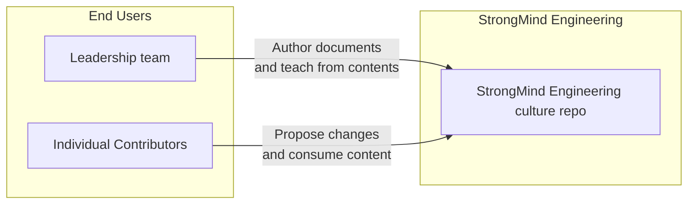

# StrongMind Engineering Culture README

## What?

This repository keeps various sets of artifacts that the StrongMind engineering team use as part of training and creating shared alignment and understanding. 

### Diagram

## Where?

### links

* dev: [dev.strongmind.com](https://dev.strongmind.com)
* prod: [strongmind.com](https://strongmind.com)

### CI/CD

* [https://github.com/StrongMind/culture/actions](https://github.com/StrongMind/culture/actions)

### Administration

* [exception tracking](https://sentry.io/organizations/strongmind-4j/)
* [monitoring & metrics dashboard](https://app.datadoghq.com/dashboard/lists?p=1)

## Local Install

* Visit [our current open positions](https://www.strongmind.com/job-openings/)
* Select a position
* Click Apply
* Speak with our recruiters
* Submit a brief code exercise
* Interview with us
* Join our team

> Code owners can be found in [CODEOWNERS file](./CODEOWNERS)
