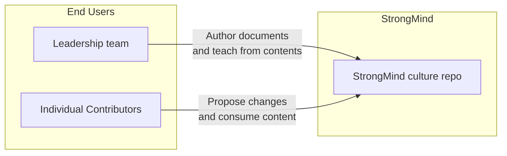

# StrongMind Culture README

## What?

This repository keeps various sets of cultural artifacts that the StrongMind engineering team use as part of training and creating shared alignment and understanding. 

### Diagram

## Where?

### links

* dev: [dev.strongmind.com](https://dev.strongmind.com)
* prod: [strongmind.com](https://strongmind.com)

### CI/CD

* [https://github.com/StrongMind/culture/actions](https://github.com/StrongMind/culture/actions)

### Administration

* [(b)logs](https://strongmind-newsletter.netlify.app/)
* [exception tracking](https://sentry.io/organizations/strongmind-4j/)
* [monitoring & metrics dashboard](#) (not implemented)

## Local Install

* Visit [our current vacancies](https://recruiting2.ultipro.com/STR1017SMINC/JobBoard/e883a137-8797-484c-bf4d-c3d514ec5e38/?q=&o=postedDateDesc&w=&wc=&we=&wpst=&f5=fomFUKZBpE-POmuBhDZQgQ)
* Select vacancy
* Click Apply Now
* Speak with our recruiters in the USA or the Phillippines
* Submit a Pizza Server kata code sample
* Interview with us
* Join our team

> Code owners can be found in [CODEOWNERS file](./CODEOWNERS)
