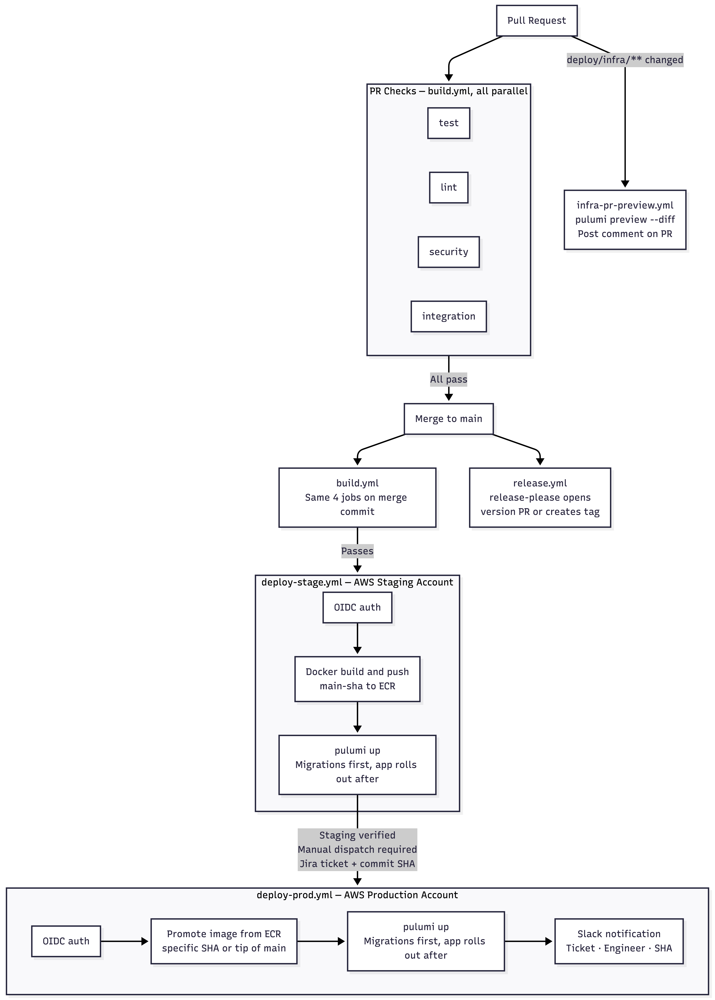

# CI/CD Standards — Go

Every Go service at StrongMind must follow this pipeline. The reference implementation is `strongmind-attendance` — if you need a working example, start there.

## Flow



## PR Checks

**Required**: Every pull request must pass four parallel jobs before it can merge. Running them in parallel keeps feedback fast — a failing security scan should not wait behind a slow integration test suite.

| Job | Tool |
|---|---|
| `test` | `go test -race ./...` |
| `lint` | golangci-lint |
| `security` | gosec (static analysis) and Trivy (dependency scan, HIGH and CRITICAL only) |
| `integration` | Real Postgres and LocalStack — see Integration Tests below |

The same four jobs run again on the merge commit after a push to `main`. This catches any issues introduced during the merge itself.

## Integration Tests

**Required**: Integration tests must run against real services, not mocks. Mocks let your implementation diverge from reality. We have had production failures caused by tests that passed against mocks but broke against the real database.

Use GitHub Actions service containers to spin up Postgres and LocalStack. Run your database migrations with `goose` before the tests start so every test runs against a real, up to date schema.

```
goose -dir migrations postgres $DATABASE_URL up
go test -tags=integration -timeout=120s ./...
```

Mocks are only acceptable for external SaaS APIs that have no local emulator, for example a third party payment provider. Never mock Postgres or AWS services.

## Infrastructure PR Preview

**Required** for any service that manages its own Pulumi infrastructure.

When a pull request touches `deploy/infra/**`, the pipeline must run `pulumi preview --diff` against the staging stack and post the diff as a comment on the pull request. This surfaces infrastructure misconfigurations — broken IAM policies, missing environment variables, resource name conflicts — before they reach staging and block the team.

The comment must update on each new push so reviewers always see the current diff.

## Release Management

**Required** for Go services. Use [Conventional Commits](https://www.conventionalcommits.org/) for all commit messages. This gives you an auditable changelog and drives automatic versioning via [release-please](https://github.com/googleapis/release-please).

| Commit prefix | What it signals | Version bump |
|---|---|---|
| `fix:` | A bug was fixed | patch |
| `feat:` | New behaviour was added | minor |
| `feat!:` or `BREAKING CHANGE:` | Existing behaviour changed | major |

`release-please` runs on every push to `main`. It maintains a release pull request that accumulates unreleased changes. When that pull request is merged, it creates a GitHub release and tag automatically with no manual versioning required.

## Staging Deploy

**Required**: Staging deploys must trigger automatically after `build` passes on `main`. Do not require a manual step to get code to staging. That friction causes teams to batch changes and lose the safety of small, frequent deploys.

Staging deploys must be queued, not cancelled. If two merges happen in quick succession, the second deploy waits for the first to finish. Cancelling a deploy that is in progress can leave infrastructure in a broken state.

The Docker image is tagged `main-{sha}` so every staging deploy is traceable to a specific commit.

Database migrations run as a one shot task before any app containers are replaced. A failed migration stops the deploy before rollout begins. You will never have app containers running against an incompatible schema.

## Docker Image Scanning

**Required**: After the Docker image is built and pushed to ECR, scan it with Trivy before the deploy proceeds. The filesystem scan in the `security` job runs before the image is built and cannot see vulnerabilities introduced by the base image or the build process itself. The image scan covers those gaps.

Fail the deploy on HIGH and CRITICAL findings. The scan runs as a step in `deploy-stage.yml` between the image push and `pulumi up`.

```yaml
- name: Scan image for vulnerabilities
  uses: aquasecurity/trivy-action@<sha> # pin to SHA
  with:
    image-ref: ${{ steps.login-ecr.outputs.registry }}/<service-name>:main-${{ github.sha }}
    severity: HIGH,CRITICAL
    exit-code: 1
```

## Production Deploy

**Required**: Production deploys are manual only. No code should reach production automatically.

Every production deploy requires a Jira ticket URL as an input. This creates a lightweight audit trail so you can always answer who deployed what and why by looking at the workflow run history.

The deploy accepts an optional commit SHA so you can promote a specific already built image rather than always deploying the tip of main. This matters during an incident when you need to deploy a known good commit rather than whatever happens to be at the top of the branch.

**Expected**: Send a Slack notification on every production deploy that includes the Jira ticket link, the deploying engineer, and the commit SHA.

## AWS Credentials

**Required**: Use OIDC federation. Never store long lived AWS access keys in GitHub secrets.

OIDC lets GitHub Actions assume an AWS IAM role without a stored secret. If a workflow is compromised there is no credential to steal because the token is short lived and scoped to a specific repository and branch.

Scope the OIDC trust policy to the minimum needed. A trust policy scoped to the whole organisation means any compromised workflow in any StrongMind repository can assume your service's AWS role.

```
Production role:      repo:StrongMind/<service-name>:ref:refs/heads/main
Staging and PR role:  repo:StrongMind/<service-name>:*
```

The Pulumi passphrase must be fetched from AWS Secrets Manager at runtime, not stored in GitHub secrets or committed to config.

## Action Pinning

**Required**: Pin all third party GitHub Actions to a full commit SHA, not a version tag.

```yaml
# Correct
uses: actions/checkout@34e114876b0b11c390a56381ad16ebd13914f8d5 # v4

# Not acceptable
uses: actions/checkout@v4
```

Version tags are mutable. A maintainer can silently push new code to `v4` at any time. Pinning to a SHA means the action you reviewed is the action that runs.

## Dependabot

**Required**: Enable Dependabot on every Go service repository. Outdated dependencies are the most common source of known vulnerabilities. Automated updates keep that surface area small.

```yaml
# .github/dependabot.yml
version: 2
updates:
  - package-ecosystem: gomod
    directory: /
    schedule:
      interval: weekly
  - package-ecosystem: github-actions
    directory: /
    schedule:
      interval: weekly
```

Review and merge Dependabot pull requests weekly. A backlog of ignored dependency updates defeats the purpose.

## Environments

Staging and production run in separate AWS accounts. This means a misconfigured deploy, a runaway migration, or a compromised staging credential cannot touch production infrastructure.

| Environment | AWS Account | Deploys |
|---|---|---|
| Staging | Separate account | Automatically after build passes on `main` |
| Production | Separate account | Manual only, Jira ticket required |
