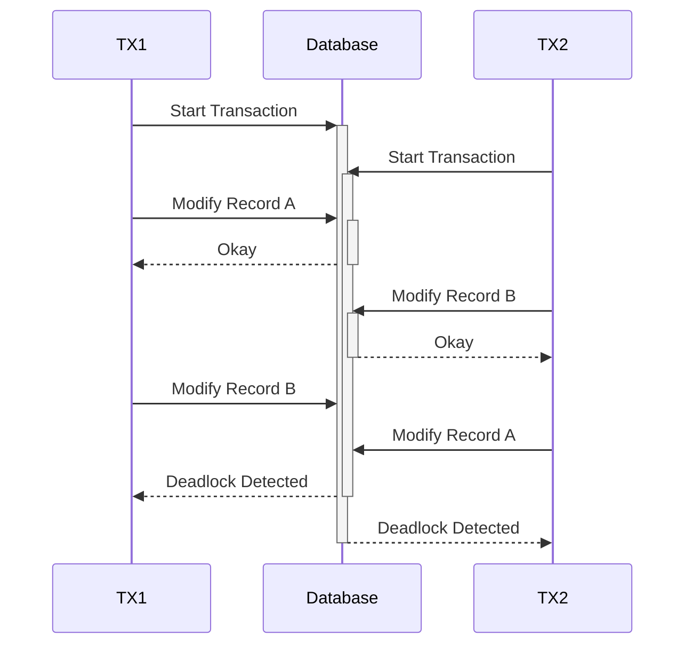
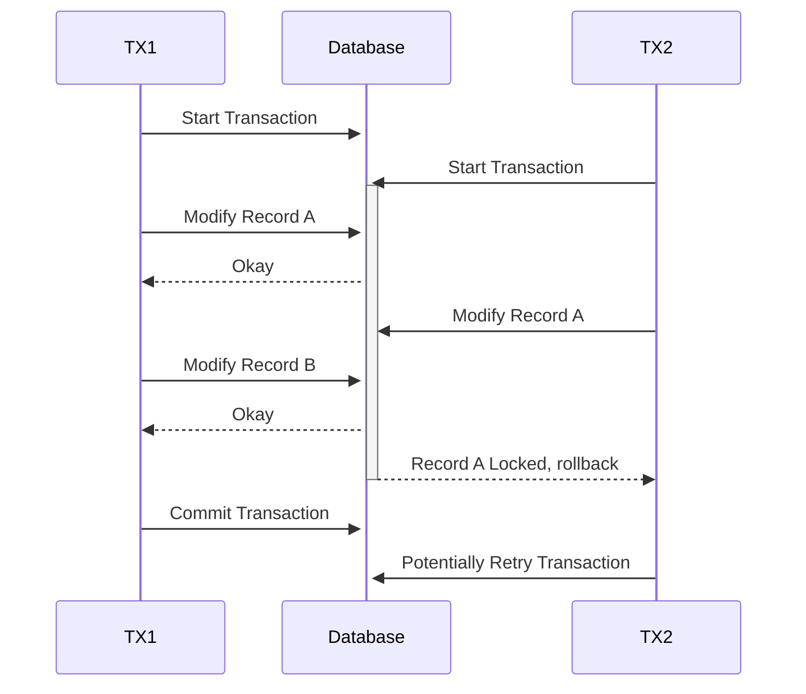

# Deadlocks in repeated similar transactions

Consistent ordering of operations within a transaction stops deadlocks in many situations

## Things to consider

* Can these operations be safely split into multiple transactions?
* If not, can these operations always happen in a consistent order using information that is solely provided in data already available to the transaction?
* If not, can these operations always happen in a consistent order using information that is in the database? (this will be slower, as you'll need to get all the modified objects, first.)