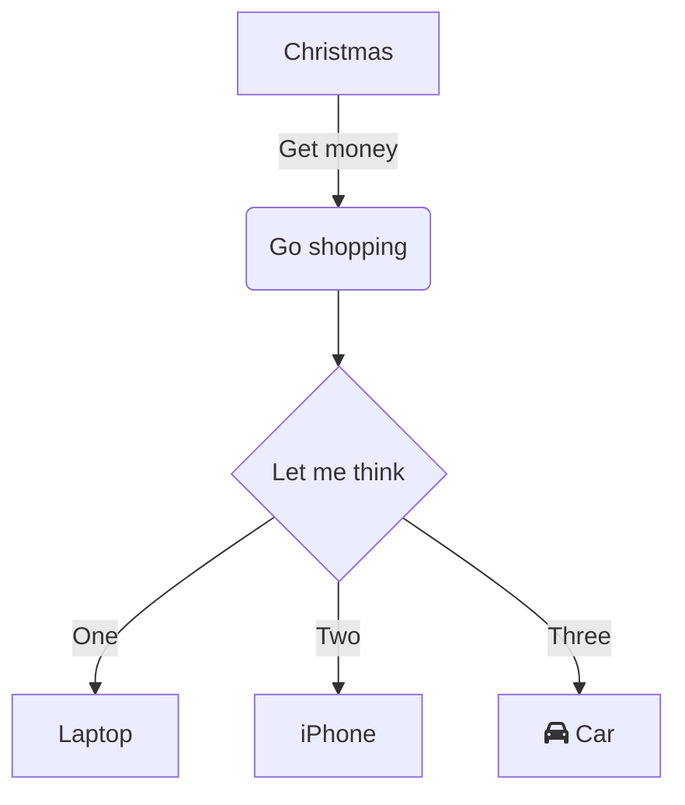

# System Visualization

## Importance of Visualization
* A visual representation of the relationship between different elements
* Communicating the big picture 
* Communicating the essence of ideas
* Communicating complexity
* Making processes more tangible

References: *[Francis Miller - The Power of Diagrams](https://www.francismiller.com/the-power-of-diagrams/)*

## Types of Diagrams
* Simple block diagram
* User Flow
* Data Flow
* Swimlane
* Unified Modeling Language
  * Structural (i.e. Class, Component, Deployment)
  * Behavorial (i.e. Use Case, Activity, Sequence, State)
* Entity-Relationship Diagram

## Simple block diagram
* Simple components
  * simple shapes (blocks, ovals)
  * words
  * lines and arrows
  * icons
* No "training" required

*ToDo: insert picture*

## User Flow diagram
* User's navigation through a product or products
  * user experience
  * sequence of steps

*ToDo: insert picture*

## Data Flow diagram
* Maps out the flow of information for any process or system
* Component Types
  * External Entity - outside system that sends/receives data
  * Process - changes data and produces output
  * Data Store - repository that persists data
  * Data Flow - direction of the flow of data

*ToDo: insert picture*

## UML Sequence Diagram
* Behavioral diagrams that detail how software operations
* Captures the interaction between objects, components, systems
* Captures order of operations

*ToDo: insert picture*

## Diagramming Tools
* Basics
  * Pencil and paper
  * Whiteboard
  * Cocktail napkin
* WYSIWYG Software Tools
  * LucidChart
  * Visio
  * Draw.IO --> app.diagrams.net
  * Gliffy
* Diagrams as Code
  * [WebSequenceDiagrams.com](https://www.websequencediagrams.com)
  * [Mermaid](https://mermaid.live)

## Introduction to Mermaid
* Create diagrams and visualizations using text and code (no drawing needed)
* Ease to generate, modify and render diagrams when you make them
* Reduces the time and effort required to create diagrams
* Embeddeble in documents (Markdown, Confluence, HTML pages)

```
graph TD
    A[Christmas] -->|Get money| B(Go shopping)
    B --> C{Let me think}
    C -->|One| D[Laptop]
    C -->|Two| E[iPhone]
    C -->|Three| F[fa:fa-car Car]
```

