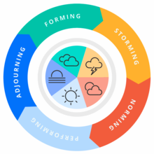
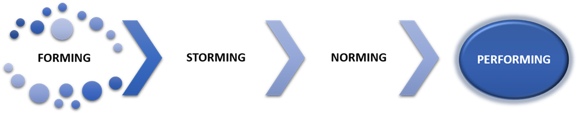

# Team Working Agreements

## What are Working Agreements?

* Describe how a team wants to work together. In practice, they are guidelines, rules, or behaviors the team has agreed on.
* Describe behaviors that are not automatically demonstrated in the team's processes.
* Create clarity and mutual expectations in a social system
* Make *implicit* social expectations *explicit*
* Align their ways of working and improve collaboration

## Why Are They Important?

### Forming, Storming, Norming, Performing

Tuckman's Stages of Group Development

### Benefits of Working Agreements
* Address mismatch of individual ways of working and expectations
* Align ways of working and improve collaboration
* Develop a sense of shared responsibility
* Increase awareness of member and team behavior
* Empowers accountability
* Enhance quality of group process
* Free to concentrate on real, wholehearted interactions, dive into creativity, and let go of social fears
* Addresses the [stories we tell ourselves](https://www.oprah.com/omagazine/brene-brown-rising-strong-excerpt) in our own heads

## Examples of Items for Working Agreements

### Presence
* core Hours
* in office days
### Behaviors
* being on time
* provide timely feedback
* ask for help
* don't interrupt others
* ok to disagree
* communicate days, hours when unavailable

### Process
* WIP limits
* use PRs when not pairing
* link pull requests to Jira tickets
* review pull requests in less than 24 hours
* adhere to definition of done for all user stories
* only work on what's on the Jira board
* interation length

## Creating and Aligning on Working Agreements

1. Carve out time to focus
1. Set the stage
    * [check in](https://liveingreatness.com/core-protocols/check-in)
    * [ice breaker](https://www.hooplaimpro.com/resource/bunny-bunny)
1. Get everyone to contribute
    * [round robin](https://www.mindtools.com/a81qk8y/round-robin-brainstorming)
    * [flowtopic](https://www.flowtopic.com)
1. Get decisions made quickly
    * [decider protocol](https://liveingreatness.com/core-protocols/decider)
1. Document where easily accessible by team members 

### Recipes:
* [Atlassian Team Playbook: Working Agreements](https://www.atlassian.com/wac/team-playbook/plays/working-agreements?)
* [How to Facilitate Powerful Working Agreements](https://resources.scrumalliance.org/Article/facilitate-powerful-working-agreements)
## Pro Tips
* keep it succinct
* revisit periodically
* revisit when members come/go
* make it easy to propose changes
* hold each other accountable
* use automation

## In-Class Exercise
(idea: a way in which we can demonstrate to people the power of working agreements)
1. Gather people in groups of 4
1. Have them complete a task as a group
1. Next, prescribe to them a small set of working agreemets
1. Have them do a different assignment with these agreements
## References
* [The essential guide to agile team working agreements](https://www.swarmia.com/blog/agile-team-working-agreements/)
* [Atlassian Team Playbook: Working Agreements](https://www.atlassian.com/wac/team-playbook/plays/working-agreements?)
* [Establishing an Agile Team Working Agreement](https://tech.gsa.gov/guides/agile_team_working_agreement)
* [Agile Team Working Agreements How To Guide](https://www.payton-consulting.com/agile-team-working-agreements-guide)
* [How to Facilitate Powerful Working Agreements](https://resources.scrumalliance.org/Article/facilitate-powerful-working-agreements)
* [Team Working Agreements: What They Are and Why You Need One](https://anexinet.com/blog/team-working-agreements-what-they-are-and-why-you-need-one)
* [Tuckman's stages of group development](https://en.wikipedia.org/wiki/Tuckman's_stages_of_group_development)
* [StrongMind Box of Autonomy](https://github.com/StrongMind/culture/blob/master/box_of_autonomy.md)
