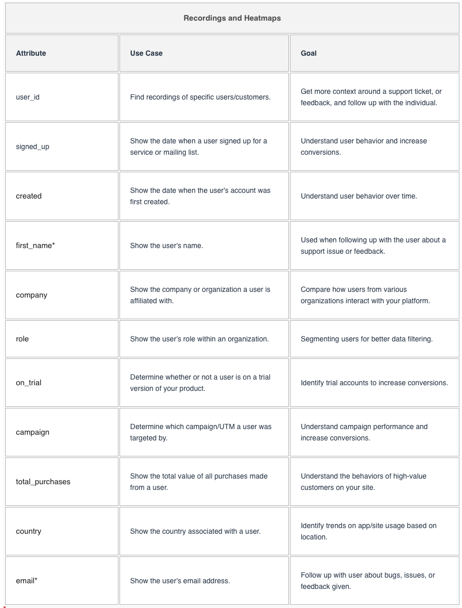

# Tools For Observation

## Google Analytics

Allows to understand what features are being used and various data on journies.

* Analytics

## Pendo

Allows to understand what features are being used and various data on journies.

* Analytics
* Feedback

## HotJar

Way to effortlessly record sessions to see how people are interacting with the application.

### Events

Trigger sessions to record based on behavior

As users interact with your site, several things can happen. Users could be clicking buttons, scrolling, or typing. Your site might also be making elements load, errors appear, or page variants to be shown, such as in an A/B test. These occurrences are examples of actions that can be used with Hotjar’s Events feature to help capture specific sessions and filter collected data to improve your insights.

### User Attributes

User Attributes are facts about your users that are sent to Hotjar. You can use them to filter Recording and Heatmap data, create Segments, or show Feedback widgets and Surveys only to specific users. User Attributes allow you to learn much more about the users you care about the most.

Follow up with user about bugs, issues, or feedback given.

### Filters
  * Rage clicks
  * U-Turns
  * New / Returning
  * Mobile / Desktop
  * Operating System
  * Events

## UserTesting.com

Fast way to get observable audience on a topic asynchronously.

* **Target.**  Create an audience profile and find people in the contributor network.
* **Ask.** Create a test plan and ask people in the audience to perform it.
* **Watch.**  Watch and hear as the audience members execute the plan.
* **Learn.**  Build customer empathy and intuition from the real world analysis.
