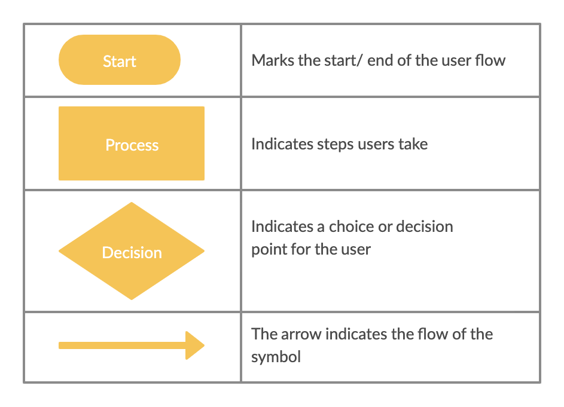

# User Flows and Story Mapping

## What is a user flow diagram?
* A chart or diagram showing the path a user will take in an application to complete a task
* Typically shows the "happy path"

## Symbols

## In Class Activity
* Create a user flow diagram of a user logging in and paying their bill using mermaid

## Why use a user flow diagram?
* Enables product teams to visually see if users are able to complete desired tasks in as few steps as possible
* Allows product teams to see where a user might encounter an error and where they should navigate to so they don't get stuck
* Product teams can use them to understand the complexities, scope, and paths of the design of a system as well as identify gaps, dependencies, and deficiencies in it
  
## In Class Activity
* Adding on to your user flow diagram any decisions where your user could get stuck or simplifiying and removing clicks

## What is story mapping?

## Why use story mapping?

## In Class Activity

## Resources
* [User flow symbols](https://creately.com/blog/diagrams/user-flow-diagram/)

