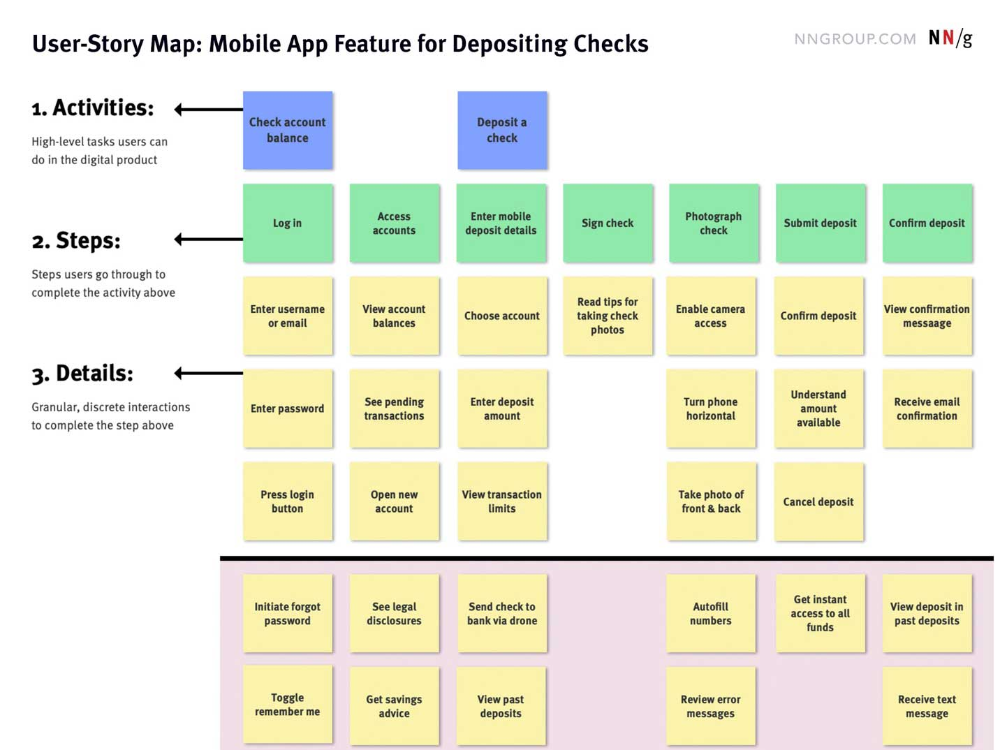

# User Flows and Story Mapping

## What is a user flow diagram?
* A chart or diagram showing the path a user will take in an application to complete a task
* Typically shows the "happy path"

## Symbols

## In Class Activity
* Partner up and create a user flow diagram of a user logging in and paying their bill using mermaid

## Why use a user flow diagram?
* Enables product teams to visually see if users are able to complete desired tasks in as few steps as possible
* Allows product teams to see where a user might encounter an error and where they should navigate to so they don't get stuck
* Product teams can use them to understand the complexities, scope, and paths of the design of a system as well as identify gaps, dependencies, and deficiencies in it
  
## In Class Activity
* Adding on to your user flow diagram any decisions where your user could get stuck and simplifiying and removing any steps from the process

## What is story mapping?
* Also known as user-story maps, story maps, and story mapping
* Lean UX-mapping method that outlines the interactions the team expects users to go through to complete their goals
* Uses sticky notes and sketches
* Jeff Patton popularized the method
* Activities, steps, and details are captured as short, succinct verb phrases representing user actions. These serve as the basis of the user-story.

## Why use story mapping?
* Replaces lengthy, technical requirement gathering and siloed updating processes
* Work well as lightweight representations of the digital product that an Agile team intends to build
* Intended to spark collaboration and conversation among Agile team members
* Provides them with the bigger picture of how the digital product flows and fits together. This latter quality of story maps is important in the Agile environment, because losing sight of the product as a whole is a common challenge, likely to arise when teams work from a discrete list of user stories in a backlog.
* Story maps can be used at any point in the product-development process to drive discussion and align the team
* They help everyone arrive at shared understanding and direction much more efficiently than creating and reading a 500-page document.
* Facilitating the creation and expansion of the product backlog

## Story mapping - how to?
* First make sure you understand the user goals and needs: Outline what users are trying to do, why the product or feature(s) you are story-mapping are important, and what real problems you’re solving
* Scope of the story map: State whether your story map will portray a current or a future iteration of the product and whether you will map an entire product, just one feature, or a section of the experience. Use caution in mapping massive products; breaking story maps up into manageable scopes and segments is often better than tackling an entire large-scale product in one story map. Being transparent about the scope of the story map upfront helps the team stay on topic and on task.
* Outcomes: Talk about what your users will be able to do as a result of launching the product or feature outlined in the map. This information will help the team maintain focus on the outcomes instead of getting too bogged down by specific solutions and tools. Focusing on outcomes also sets realistic beginning and end points for the map.
* Use sticky notes, white boards, and open wall space
* Depicts 3 types of actions at different granularity: activities (the most general actions), steps, and details (the most specific actions).  
* Activities represent the high-level tasks that users aim to complete in the digital product. Depending on the type of application or website you're creating, you may only have a few high-level activities.
* Steps sit directly underneath activities. They represent the specific subtasks that users will go through in the product to complete the activity above.
* Details are the third level of the story map and describe the lowest-granularity interactions that the team anticipates users will experience to complete the step above.

* Everyone should work together on the map; no one person or role should dominate the others.
* Assign differently colored sticky notes (whether real or virtual) to each row of activities, steps, and details to keep the story map visually organized.
* Frame your activities, steps, and details by what the user is doing at that particular point in the product, not what the product is technically doing for the user.

## In Class Activity
Let's story map something!

## Resources
* [User flow symbols](https://creately.com/blog/diagrams/user-flow-diagram/)
* [User story mapping](https://www.nngroup.com/articles/user-story-mapping/)
* [Jeff Patton](https://www.jpattonassociates.com/story-mapping/)

