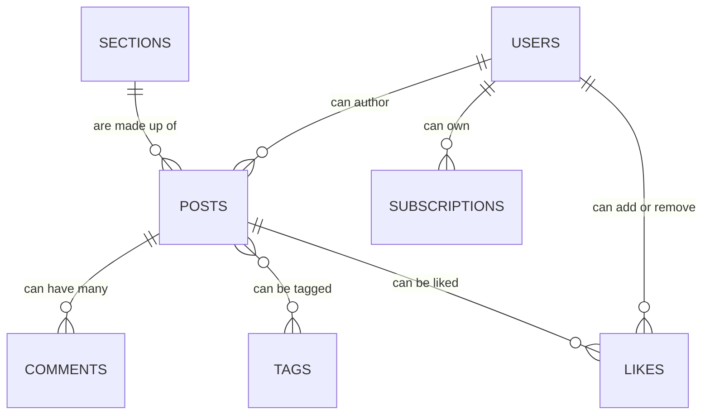

# Writing Good Models in MVC Frameworks

## Introduction

In an MVC framework, it is important to understand what code belongs in each of the pieces of the framework. 


## Overview of Each Piece

### Models

The models contain nearly all business logic and manipulate the data in the system.

This includes but is not limited to:
1. Validating data
1. Manipulating data
1. Interacting with external services
1. Interacting with other models
1. Interacting with the database

### Controllers

The controllers route external requests (primarily from views) to internal actions (primarily on models).

Controllers should handle request logic only. What is request logic? 
1. Asking models whether some action is permissible
1. Interacting with the model
1. Passing parameters and/or body from the request to the model
1. Defining response types

### Views

The views present interfaces to users. Views may use validation logic from models or mirror validation from models in client side script.

Views should handle presentation logic only. What is presentation logic?
1. Displaying data, errors, and success messages
1. Forms for creating and updating data
1. Buttons for performing actions
1. Links to other pages

## Common Maturity Levels

1. Pure CRUD models with controllers that contain all the logic and call the models simply to persist.
2. Rich models with controllers that only route requests to the models.
3. Models with common patterns refactored out into concerns.

## Smells

### Moving from Maturity Level 1 to 2
1. Controllers that contain business logic.
1. Controllers that don't map to one resource/model.
1. Controllers that have more than the basic CRUD actions.
1. Controllers that interact with models with more than 2-3 lines of code.

### Moving from Maturity Level 2 to 3
1. Model methods that are more than 8-10 lines long.
1. More than 3 or 4 methods in a model that relate to the same action.

## Examples

### Maturity Level 1

```ruby
# app/controllers/posts_controller.rb
class PostController < ApplicationController
  def create
    @post = Post.new(params)
    if @post.save
			Twitter.login(tw_credentials)
			Twitter.update(@post.body)

			Facebook.login(fb_credentials)
			Facebook.update(@post.body)

			Mastodon.login(ma_credentials)
			Mastodon.update(@post.body)

			MySpace.login(my_credentials)
			MySpace.update(@post.body)

			LinkedIn.login(li_credentials)
			LinkedIn.update(@post.body)
			redirect_to @post
    else
      render :new
    end
  end
end

# app/models/post.rb
class Post < ActiveRecord::Base
end
```

### Maturity Level 2
```ruby
# app/controllers/posts_controller.rb
class PostController < ApplicationController
  def create
    @post = Post.new(params)
    if @post.save
        redirect_to @post
    else
        render :new
    end
  end
end

# app/models/post.rb
class Post < ActiveRecord::Base
	# after save, update social media
	after_save :update_social_media

	def update_social_media
		@update_twitter
		@update_facebook
		@update_mastodon
		@update_myspace
		@update_linkedin
	end

	def update_twitter
			Twitter.login(tw_credentials)
			Twitter.update(@body)
	end

	def update_facebook
			Facebook.login(fb_credentials)
			Facebook.update(@body)
	end

	def update_mastodon
			Mastodon.login(ma_credentials)
			Mastodon.update(@body)
	end

	def update_myspace
			MySpace.login(my_credentials)
			MySpace.update(@body)
	end

	def update_linkedin
			LinkedIn.login(li_credentials)
			LinkedIn.update(@body)
	end
end
```

### Maturity Level 3
```ruby
# app/controllers/posts_controller.rb
class PostController < ApplicationController
  def create
    @post = Post.new(params)
    if @post.save
        redirect_to @post
    else
        render :new
    end
  end
end

# app/models/post.rb
class Post < ActiveRecord::Base
	include AutoSharesToSocialMedia

	def sharable_text
		@body
	end
end

# app/models/concerns/auto_shares_to_social_media.rb
module AutoSharesToSocialMedia
	extend ActiveSupport::Concern

	included do
		after_save :update_social_media
	end

	def update_social_media
		@update_twitter
		@update_facebook
		@update_mastodon
		@update_myspace
		@update_linkedin
	end

	def update_twitter
			Twitter.login(tw_credentials)
			Twitter.update(@sharable_text)
	end

	def update_facebook
			Facebook.login(fb_credentials)
			Facebook.update(@shareable_text)
	end

	def update_mastodon
			Mastodon.login(ma_credentials)
			Mastodon.update(@shareable_text)
	end

	def update_myspace
			MySpace.login(my_credentials)
			MySpace.update(@shareable_text)
	end

	def update_linkedin
			LinkedIn.login(li_credentials)
			LinkedIn.update(@shareable_text)
	end
end
```

### Model Association Examples

```ruby
# app/models/post.rb
class Post < ActiveRecord::Base
	has_many :comments
	has_many :likes
	has_and_belongs_to_many :tags
	belongs_to :section
end

# app/models/user.rb
class User < ActiveRecord::Base
	has_many :subscriptions
	has_many :posts
	has_many :comments
	has_many :likes
end

# app/models/comment.rb
class Comment < ActiveRecord::Base
	belongs_to :user
	belongs_to :post
end

# app/models/like.rb
class Like < ActiveRecord::Base
	belongs_to :user
	belongs_to :post
end

# app/models/subscription.rb
class Subscription < ActiveRecord::Base
	belongs_to :user
end

# app/models/section.rb
class Section < ActiveRecord::Base
	has_many :posts
end

# app/models/tag.rb
class Tag < ActiveRecord::Base
	has_and_belongs_to_many :posts
end

```

