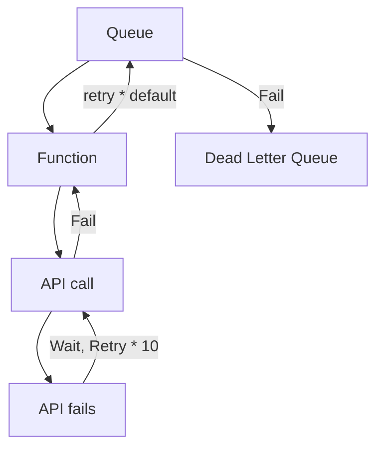
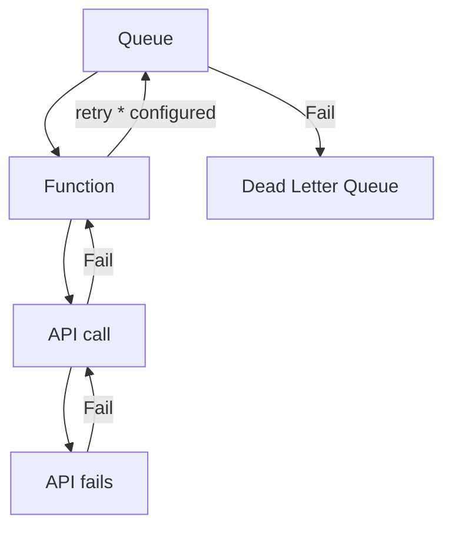

# Managing retries via queues vs in-process

I've been seeing a pattern of retrying HTTP requests for downstream APIs in process when handling events from queues. There are some problems with this, which can result in significant scaling issues and a massive increase of cloud costs in an outage scenario.

Furthermore, it can obscure problems and make debugging harder in our larger ecosystem - if multiple systems in a row do this, it can also multiply exponentially.

### Examples

The two most recent examples of this that I have seen, [one in Python](https://github.com/StrongMind/id-mapper-client/pull/6/files) and [one in C#](https://github.com/StrongMind/MessageEngine/pull/2/files) for illustration both work in this fashion.

The problem with this flow is that during the time we are in wait and retry, we are holding a function execution open during the wait. During this time, we're both being charged for that function execution time, but we're also holding a spot against our potential maximum number of concurrent connections in either Azure or AWS. We're also not managing the number of retries we make in a visible way, as our queues will be retrying for a certain amount of times and therefore the retry number that is placed in the code 

Queueing systems have retries built in, and we can manage retries without the waits taking up function space. This means that time waiting is time spent in the queue, rather than in the application.

